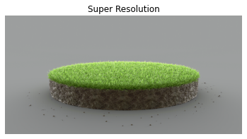
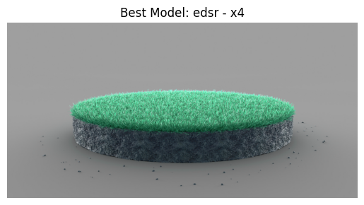

# 🖼️ Image Upscaling with Deep Learning Models

## 📌 Project Overview
This project focuses on enhancing and upscaling low-resolution images using deep learning models, primarily **ESRGAN** and a comparison of other models (**EDSR**, **LapSRN**, **ESPCN**, **FSRCNN**). The goal is to improve image quality by increasing resolution while preserving details, with **EDSR** achieving the highest performance (PSNR: 62.73, SSIM: 0.9999).

---

## 🔍 Project Workflow

### **1. Image Preprocessing**
Prepare images by removing alpha channels, cropping, and normalizing.

```python
import tensorflow as tf
import cv2
from PIL import Image
import numpy as np

def preprocess_image(image_path):
    hr_image = tf.image.decode_image(tf.io.read_file(image_path))
    if hr_image.shape[-1] == 4:
        hr_image = hr_image[..., :-1]
    hr_size = (tf.convert_to_tensor(hr_image.shape[:-1]) // 4) * 4
    hr_image = tf.image.crop_to_bounding_box(hr_image, 0, 0, hr_size[0], hr_size[1])
    return tf.expand_dims(tf.cast(hr_image, tf.float32), 0)
```

### **2. ESRGAN Model**
Upscale images using the ESRGAN model.

```python
def save_image(image, filename):
    image = tf.clip_by_value(image, 0, 255)
    image = Image.fromarray(tf.cast(image, tf.uint8).numpy())
    image.save(f"{filename}.jpg")

# Load and apply ESRGAN model
model = tf.saved_model.load('ESRGAN_tf2')
lr_image = preprocess_image('test.jpg')
sr_image = model(lr_image)
save_image(sr_image[0], 'output_results/esrgan_output')
```

### **3. Model Comparison**
Compare four models (EDSR, LapSRN, ESPCN, FSRCNN) using PSNR and SSIM metrics.

```python
models = [
    ('edsr', 4, 'EDSR_x4.pb'),
    ('lapsrn', 4, 'LapSRN_x4.pb'),
    ('espcn', 4, 'ESPCN_x4.pb'),
    ('fsrcnn', 4, 'FSRCNN_x4.pb'),
]

for name, scale, path in models:
    model = tf.saved_model.load(path)
    lr_image = preprocess_image('test.jpg')
    sr_image = model(lr_image)
    save_image(sr_image[0], f'output_results/{name}_output')
```

### **Model Definitions**
- **EDSR**: Enhanced Deep Super-Resolution, uses a deep residual network for high-quality upscaling. Best for preserving fine details.
- **LapSRN**: Laplacian Pyramid Super-Resolution Network, employs a progressive upscaling approach. Efficient for multi-scale enhancement.
- **ESPCN**: Efficient Sub-Pixel Convolutional Network, performs upscaling in a single step. Lightweight and fast.
- **FSRCNN**: Fast Super-Resolution Convolutional Neural Network, optimizes speed and quality. Suitable for real-time applications.

---

## 📊 Results
| Model    | PSNR  | SSIM   |
|----------|-------|--------|
| EDSR     | 62.73 | 0.9999 |
| LapSRN   | 48.14 | 0.9987 |
| ESPCN    | 52.70 | 0.9996 |
| FSRCNN   | 48.75 | 0.9984 |

- **Best Model**: EDSR (PSNR: 62.73, SSIM: 0.9999)  

- **ESRGAN Result**:  
    

- **EDSR Result**:  
    

- **Comparison**: Results for all models are saved in `output_results/`.


---

## 📦 Requirements
```bash
pip install tensorflow opencv-python numpy matplotlib pillow
```

---

## ▶️ How to Run
1. Clone the repository:
   ```bash
   git clone https://github.com/ali27kh/Enhance_Upscale_images.git
   cd Enhance_Upscale_images
   ```
2. Install dependencies.
3. Test the models.

---

## 📌 Key Insights
- **EDSR** outperforms other models with a PSNR of 62.73 and SSIM of 0.9999, ideal for high-quality upscaling.
- **ESRGAN** produces visually appealing results with enhanced textures.
- Preprocessing (cropping, normalization) ensures compatibility with model inputs.
- Model comparison highlights trade-offs between speed (FSRCNN, ESPCN) and quality (EDSR, LapSRN).

---

## 📜 License
MIT License
